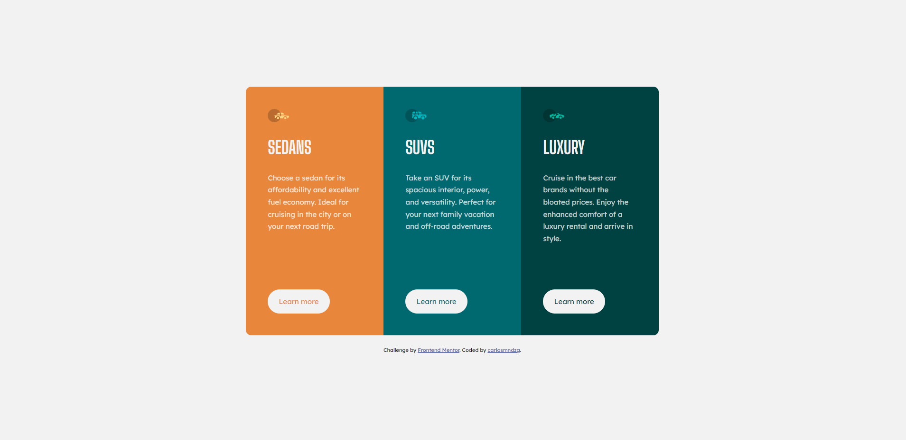

# Frontend Mentor - 3-column preview card component solution

This is a solution to the [3-column preview card component challenge on Frontend Mentor](https://www.frontendmentor.io/challenges/3column-preview-card-component-pH92eAR2-). Frontend Mentor challenges help you improve your coding skills by building realistic projects.

## Table of contents

- [Overview](#overview)
  - [The challenge](#the-challenge)
  - [Screenshot](#screenshot)
  - [Links](#links)
- [My process](#my-process)
  - [Built with](#built-with)
  - [What I learned](#what-i-learned)

## Overview

### The challenge

Users should be able to:

- View the optimal layout depending on their device's screen size
- See hover states for interactive elements

### Screenshot



### Links

- Solution URL: [Solution URL](https://github.com/carlosmndzg/3-column-card-component)
- Live Site URL: [Live Site URL](https://3-column-card-component-dev.netlify.app/)

## My process

### Built with

- Semantic HTML5 markup
- CSS custom properties
- Flexbox
- CSS Grid
- Mobile-first workflow

### What I learned

A more advanced way to use custom properties, that allowed me to respect DRY principle in CSS, changing the colors of each card in a very easy way as shown below:

```css
.card:nth-child(1) {
  --default-color: var(--bright-orange);
}

.card:nth-child(2) {
  --default-color: var(--dark-cyan);
}

.card:nth-child(3) {
  --default-color: var(--very-dark-cyan);
}
```

And also I got more experienced using CSS Grid.
